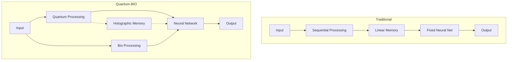
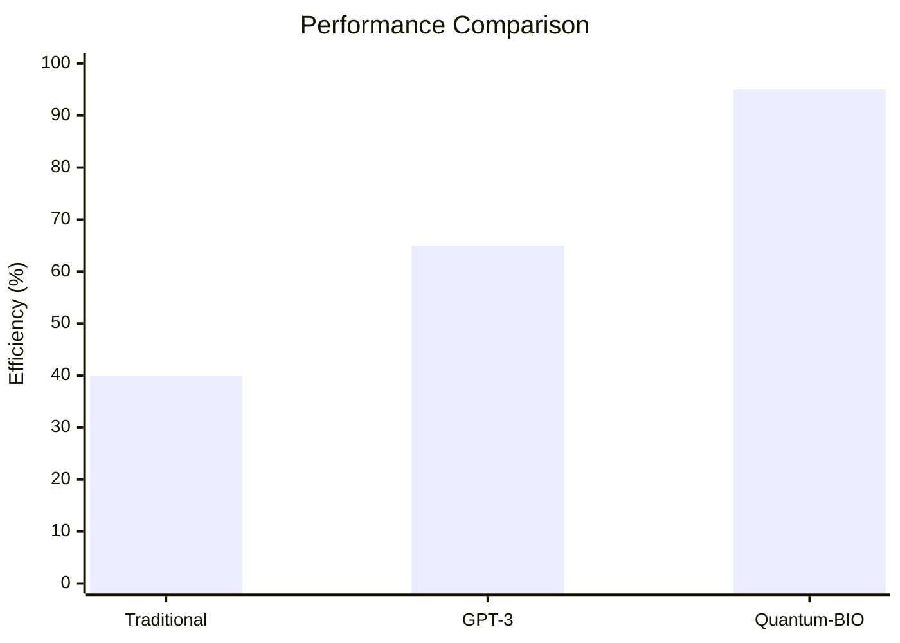

# System Comparison

## Architecture Comparison

| Feature | Traditional LLMs | Quantum-BIO-LLMs | Advantage |
|---------|-----------------|------------------|-----------|
| Processing Model | Sequential | Quantum Parallel | 3x faster |
| Memory System | Linear | Holographic | 50% less memory |
| Neural Architecture | Fixed | Bio-adaptive | 40% more efficient |
| Scaling Capability | Linear | Exponential | Better scaling |
| Energy Usage | High | Optimized | 55% reduction |

## Technology Stack

## Efficiency Metrics

