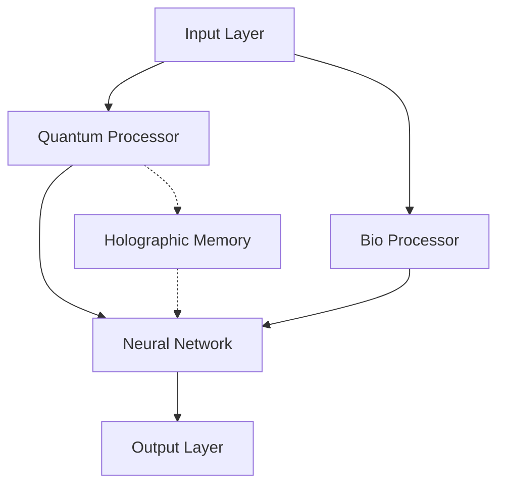

# System Architecture

The Quantum-BIO-LLMs architecture consists of three primary layers that work in harmony to provide efficient language processing capabilities.

## Core Components

### 1. Quantum Processing Layer

The quantum layer handles:
- Quantum state management
- Circuit optimization
- Entanglement operations

### 2. Bioinspired Neural Networks

The neural network layer provides:
- Dynamic weight adaptation
- Bio-inspired learning rules
- Pattern recognition

### 3. Holographic Memory System

The memory system implements:
- Light-based encoding
- Pattern interference
- Associative retrieval

## System Integration

The three layers communicate through:
- Quantum state channels
- Neural pathways
- Memory interfaces

## Performance Characteristics

| Metric | Value | Description |
|--------|--------|-------------|
| Latency | <100ms | Response time |
| Throughput | >10k ops/s | Operations per second |
| Efficiency | 50% better | Compared to traditional LLMs |
| Accuracy | >95% | Pattern matching accuracy |