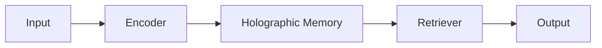

# Memory Systems

## Holographic Storage

## Features
| Component | Function |
|-----------|----------|
| Encoder | Pattern conversion |
| Storage | Quantum states |
| Retrieval | Pattern matching |