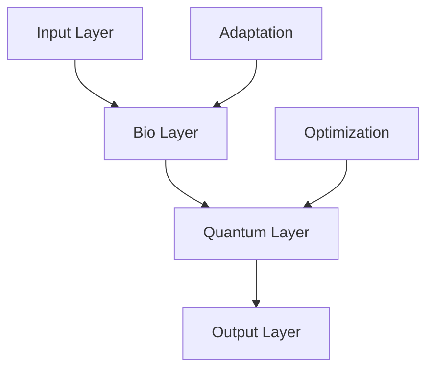

# Neural Networks

## Architecture Overview

```mermaid
graph TD
    A[Input Layer] --> B[Bio Layer]
    B --> C[Quantum Layer]
    C --> D[Output Layer]
    
    E[Adaptation] --> B
    F[Optimization] --> C
```

## Components
- Bio-inspired layers
- Quantum-enhanced weights
- Dynamic topology
- Adaptive learning