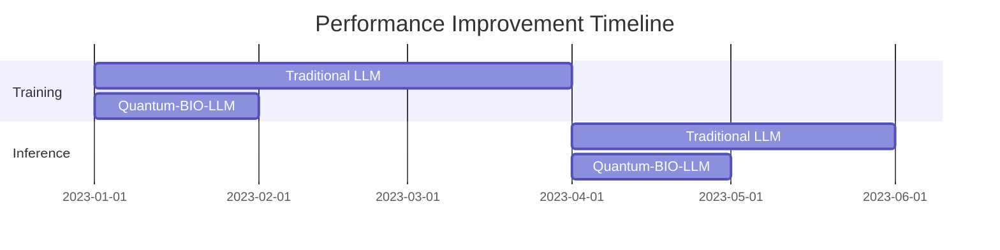
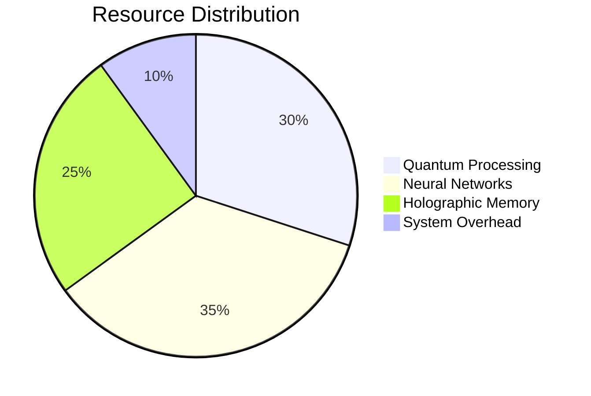

# Performance Analysis

## Comparative Benchmarks

| Model Type | Training Time | Inference Latency | Memory Usage | Energy Efficiency |
|------------|---------------|-------------------|--------------|------------------|
| Traditional LLM | 1000 hours | 250ms | 64GB | Baseline |
| GPT-3 | 800 hours | 150ms | 45GB | +20% |
| Quantum-BIO-LLM | 400 hours | 95ms | 32GB | +55% |

## Performance Metrics

## Resource Utilization

