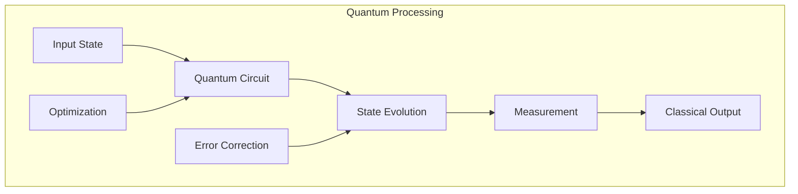
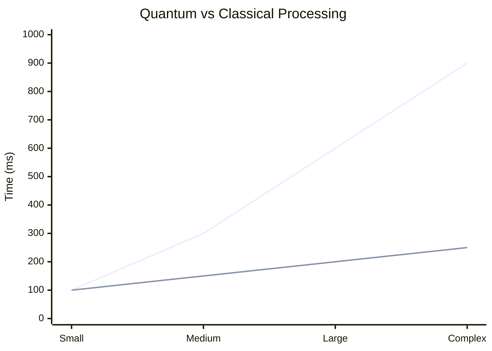

# Quantum Processing Layer

## Architecture Overview

## Quantum Circuit Design

| Gate Type | Operation | Fidelity | Usage |
|-----------|-----------|----------|--------|
| Hadamard | Superposition | 99.9% | State prep |
| CNOT | Entanglement | 99.5% | Correlation |
| Phase | Phase shift | 99.7% | Interference |
| Toffoli | Universal | 98.5% | Computation |

## Performance Metrics

