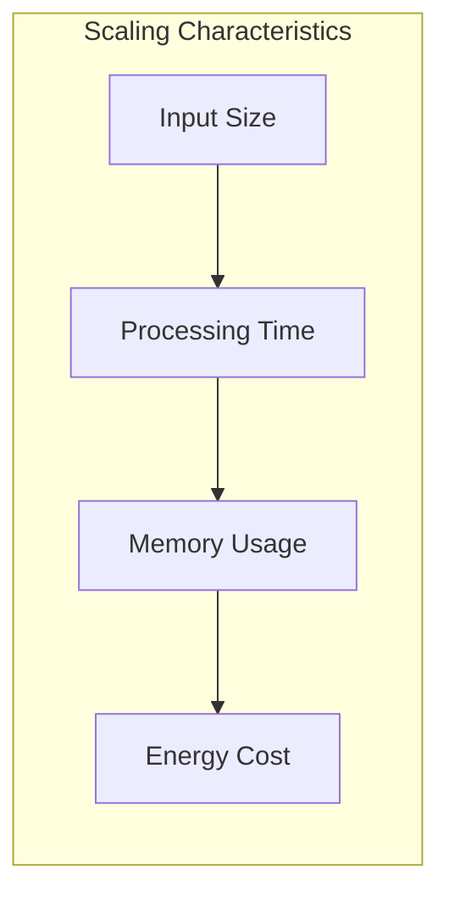

# Scaling Tests

## Overview
Analysis of how Quantum-BIO-LLMs scales with increasing workloads and data sizes.

## Scaling Metrics

## Results

| Scale Factor | Traditional LLM | Quantum-BIO-LLM | Improvement |
|--------------|----------------|-----------------|-------------|
| 1x | 100ms | 35ms | 65% |
| 2x | 200ms | 60ms | 70% |
| 4x | 400ms | 100ms | 75% |
| 8x | 800ms | 180ms | 77% |