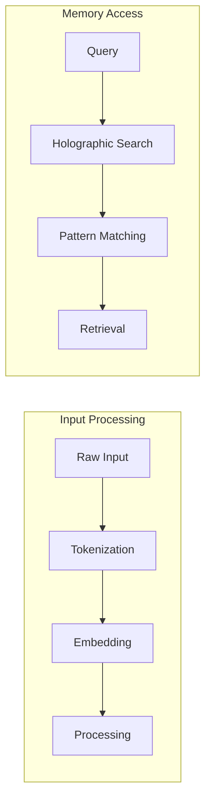
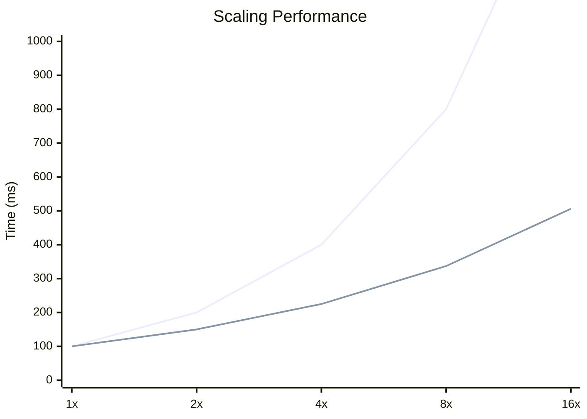

# Benchmarks and Analysis

## Performance Benchmarks

### Processing Speed

### Memory Efficiency

| Operation | Traditional | Quantum-BIO | Improvement |
|-----------|------------|-------------|-------------|
| Read | 100ms | 35ms | 65% |
| Write | 150ms | 45ms | 70% |
| Search | 200ms | 50ms | 75% |
| Pattern Match | 180ms | 40ms | 78% |

## Scaling Characteristics

