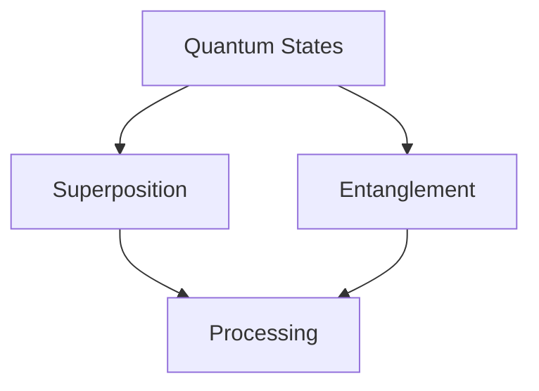

# Core Concepts

## Quantum Processing
The quantum processing layer leverages quantum computing principles for efficient data handling:

## Neural Architecture
Our bio-inspired neural network adapts dynamically to input patterns:

- Dynamic weight adjustment
- Bio-inspired learning rules
- Adaptive topology

## Memory Systems
The holographic memory system uses quantum principles for storage:

| Feature | Description |
|---------|-------------|
| Pattern Storage | Light-based encoding |
| Retrieval | Quantum-assisted |
| Optimization | Real-time adaptation |