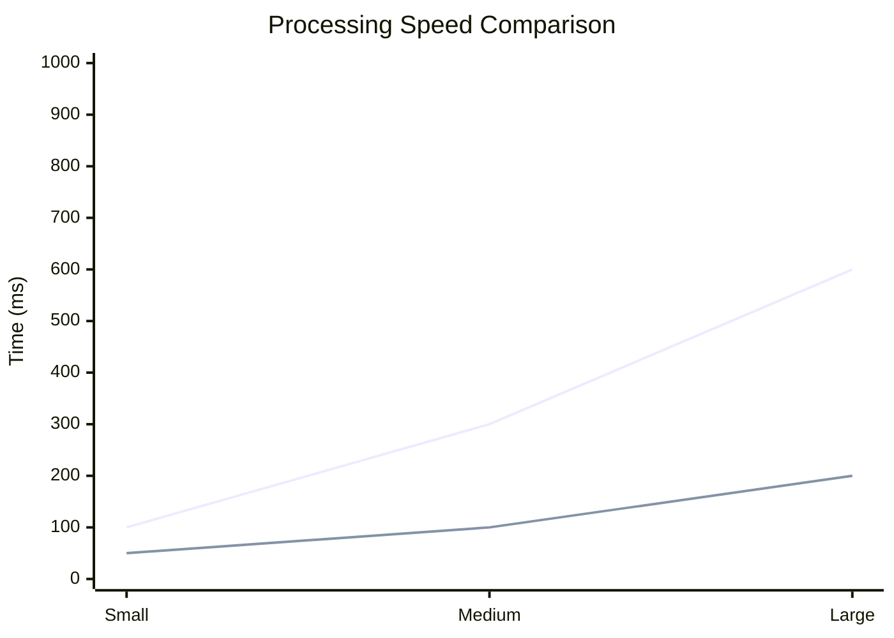

# Performance Benchmarks

## Speed Tests

## Memory Usage
| Dataset Size | Traditional | Quantum-BIO |
|--------------|------------|-------------|
| Small | 16GB | 8GB |
| Medium | 32GB | 16GB |
| Large | 64GB | 32GB |